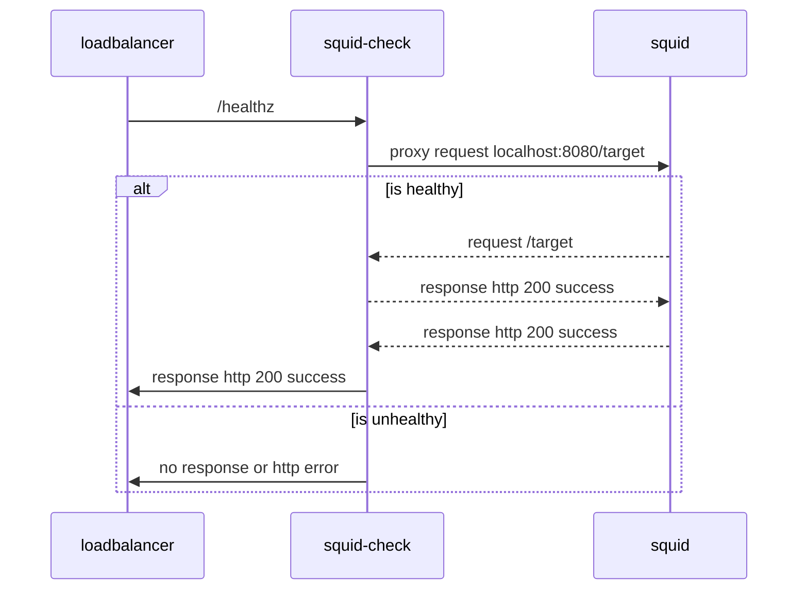

# Squid Health Checker

`squid-check` is a health check service for [Squid](http://www.squid-cache.org). It can be used by load balancers to detect when squid is not responding to requests and remove the instance from the load balancer. If the load balancer is also configured for [direct server return (DSR)](https://www.haproxy.com/blog/layer-4-load-balancing-direct-server-return-mode), squid-check allows for safely draining a squid instance. To safely drain a squid instance, squid-check can be stopped which will cause the health check to fail and the load balancer will stop routing new requests to squid allowing the existing connections to disconnect when they complete.

Squid-check can also be used as a sidecar in a squid kubernetes deployment. It can be used as an additional container in the same pod as squid and used to inform kubernetes liveness and/or readiness checks.

## Design

Squid-check works by serving two endpoints. One endpoint always returns a 200 and another makes a request via squid back to the endpoint that returns the 200. This validates squid is proxying requests and is likely healthy.

- `/healthz`: Healthz makes a proxied request using the local squid instance (`127.0.0.1:3128`) to `/target` served by this app.
- `/target`: The target endpoint always returns a http 200 with a text body of `success`.

Squid-check listens on `0.0.0.0:8080` by default and attempts to make proxied requests to `127.0.0.1:3128`.



```shell
Usage of /usr/local/bin/squid-check:
  -listen-address string
        Address to listen on (default "0.0.0.0:8080")
  -log-level string
        Log level (default "warn")
  -proxy-address string
        Address of squid proxy (default "127.0.0.1:3128")
  -target-address string
        Address of proxied health check target (default "127.0.0.1:8080")
  -version
        Print version and exit
```

## Installation

Squid-check is intended to be installed/running on the same host/pod as squid. We pre-build both the binary and a container.

### Binary

When using the binary it is best to run the app using a systemd unit.

Download the binary:

```shell
# download the latest linux release of squid-check and the checksum file
curl -L -o squid-check_Linux_x86_64.tar.gz https://github.com/persona-id/squid-check/releases/latest/download/squid-check_Linux_x86_64.tar.gz
curl -L -o checksums.txt https://github.com/persona-id/squid-check/releases/latest/download/checksums.txt


# check the shasum and extract it if it matches
sha256sum --status -c checksums.txt &&\
  tar -xzvf squid-check_Linux_x86_64.tar.gz
```

Example systemd unit `squid-check.service`:

```ini
[Unit]
Description=Check health of Squid by sending requests though it to a web server
After=syslog.target network.target remote-fs.target nss-lookup.target
StartLimitIntervalSec=500
StartLimitBurst=5

[Service]
Restart=on-failure
RestartSec=5s
ExecStart=/usr/local/bin/squid-check

[Install]
WantedBy=multi-user.target
```

Suggested installation:
1. Copy `squid-check` to `/usr/local/bin/squid-check`.
2. `sudo chmod +x /usr/local/bin/squid-check`.
3. Copy `squid-check.service` to `/etc/systemd/system/squid-check.service`
4. Reload systemd files with `sudo systemctl daemon-reload`
5. Enable squid check `sudo systemctl enable --now squid-check`
6. Allow squid-check to proxy connections through squid by adding the following to `/etc/squid/squid.conf`. Squid may already be configured to deny traffic to localhost:

    ```squidconf
    http_access allow localhost to_localhost
    http_access deny to_localhost
    ```

## Container Image

We pre-build a container image for squid-check. It can be used in conjunction with a squid kubernetes deployment.

```shell
docker pull ghcr.io/persona-id/squid-check:latest
```

## Development

There is a docker compose file to provide a local development environment. The compose file consists of a container running `squid-check` and an additional container running squid.

To use the environment:

1. `docker-compose up --build`
2. Make requests to `http://localhost:8080/healthz` or another endpoint served by squid-check. If you have the vscode rest client installed you can use `http_client_tests.rest` to send requests to the various endpoints.

## Releasing

The project is using [goreleaser](https://goreleaser.com) and will automatically publish a release on new tag push. Currently, it builds both a linux binary and a container image.

1. `git tag -a vX.Y.Z`
2. `git push origin vX.Y.Z`
